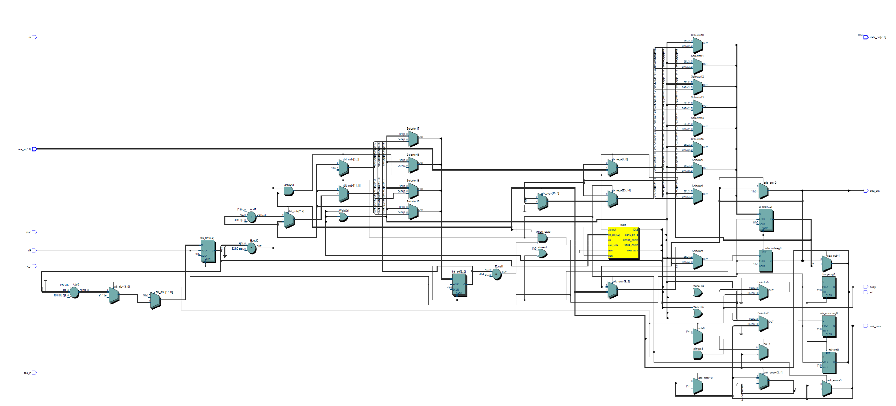
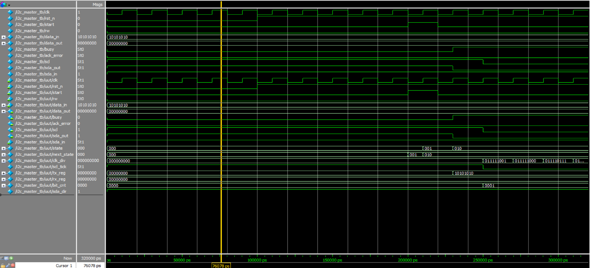

# I2C Master Controller

A simple Verilog HDL project implementing a basic **I2C Master** controller, including Start, Send Byte, Wait ACK, and Stop sequence handling.

---

## 📚 Project Structure

| File | Description |
|:---|:---|
| `i2c_master.v` | Main Verilog source code for I2C Master |
| `i2c_master_tb.v` | Testbench for functional simulation |
| `RTL_i2c_master.png` | RTL schematic generated by Quartus |
| `wave_i2c_master_tb.png` | Simulation waveform captured from ModelSim |

---

## 🎯 Features

- Generate I2C Start and Stop conditions
- Send 8-bit data with automatic bit shifting
- Handle Slave ACK response checking
- Internal clock divider to generate SCL
- Simple state machine-based design (IDLE → START → SEND_BYTE → WAIT_ACK → STOP)
- Bus error detection (ACK error)
- Verified with ModelSim simulation

---

## 🧩 RTL Architecture

RTL structure automatically generated by Quartus Prime:

---

## 📈 Simulation Waveform

Simulation result using ModelSim:  
The waveform demonstrates correct behavior of Start condition, 8-bit data transfer, ACK reception, and Stop condition.

---

## 🚀 How to Simulate

1. Compile `i2c_master.v` and `i2c_master_tb.v` in ModelSim.
2. Run simulation.
3. Observe SCL, SDA, busy, and data_out signals.

---

## 🛠️ Environment

- Verilog HDL
- Intel Quartus Prime Lite Edition 18.0
- ModelSim Intel FPGA Edition 10.5b

---

